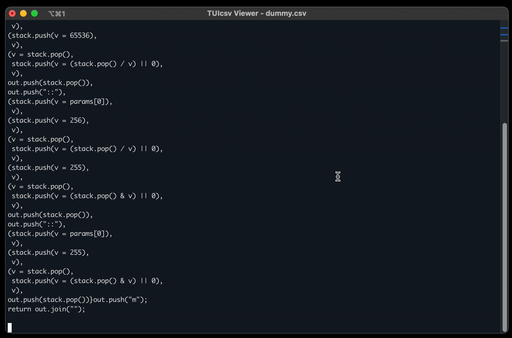

# TUIcsv Viewer

A robust, terminal-based user interface (TUI) application for viewing, filtering, searching, and managing CSV files directly from your command line. Built with Node.js, it offers a rich interactive experience with persistent settings, theming support, and virtualization for large files.



## Features

- **Interactive Table View**: Scrollable and navigable table interface optimized for large CSV datasets (Virtual Scrolling).
- **Search**: Global search functionality to quickly filter rows.
- **File Manager**: Built-in file explorer to browse and open `.csv` files dynamically.
- **Column Filtering**: Toggle visibility of specific columns to focus on relevant data.
- **Sorting**: Sort data by any column in Ascending or Descending order.
- **Export**: Export your filtered and sorted view to a new CSV file.
- **Persistent Settings**: Remembers your column preferences per file and global app settings.
- **Theming**: Includes multiple color themes (Dark, Ocean, Sunset, Retro, Matrix, High Contrast).
- **Animations**: Loading spinners and smooth interactions.
- **Mouse Support**: Fully clickable interface.

## Requirements

- **Node.js**: Version 12 or higher.
- **npm**: Installed with Node.js.
- **Terminal**: A terminal emulator with color support.

## Installation

1.  Clone the repository:
    ```bash
    git clone https://github.com/a2-stuff/TUIcsv.git
    cd TUIcsv
    ```

2.  Install dependencies:
    ```bash
    npm install
    ```

3.  (Optional) Link globally to run from anywhere:
    ```bash
    npm link
    ```

## Usage

### Starting the App

To open the viewer with the file manager:
```bash
npm start
```

To open a specific file directly:
```bash
node index.js path/to/your/file.csv
# OR if linked globally
tuicsv path/to/your/file.csv
```

### Key Bindings & Controls

- **Navigation**: Arrow Keys (`Up`, `Down`, `Left`, `Right`), `PageUp`/`PageDown`, `Home`/`End`, or `Vi` keys (`h`, `j`, `k`, `l`).
- **Menu Access**: Click the top menu bar or use hotkeys.
- **Select/Sort**: `Enter` to select or sort a column.
- **Quit**: `q`, `Ctrl+C`, or select `Quit` from the menu.

65: #### Dialog Shortcuts
66: - **Save/Search**: `Ctrl+s`
67: - **Reset**: `Ctrl+r`
68: - **Cancel**: `Escape`
69: - **Clear**: `Ctrl+l`

## Configuration

Settings are automatically saved using `conf`. You can reset all settings via the **Settings** menu inside the application.

## Themes

Change the visual style in the **Settings** menu. Available themes:
- **Dark** (Default)
- **Ocean**
- **Sunset**
- **Retro**
- **Matrix**
- **High Contrast**

## Author

Created by [@not_jarod](https://github.com/a2-stuff/TUIcsv).

## License

ISC License